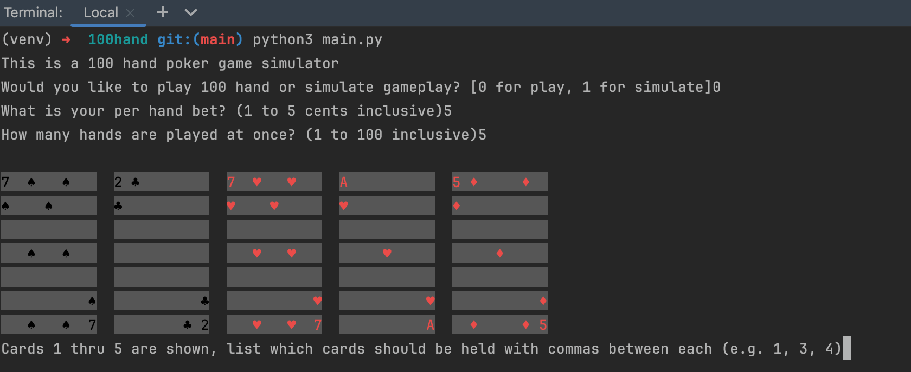
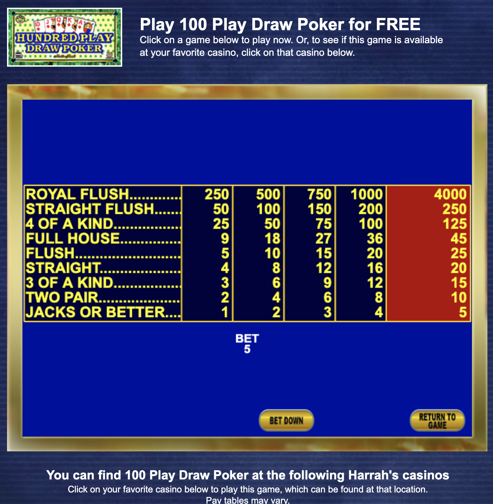

# This is a 100 hand poker simulator

For examining play of large numbers of hands played and trying different strategies.

## How to run: ##

This guide will walk you through the steps to run the **100hand** Python program on your computer.

## Requirements

- Python installed on your machine. You can download it from [Python's official website](https://www.python.org/downloads/).
- Libraries imported in main.py and functions.py

Jacob Miske

MIT License

